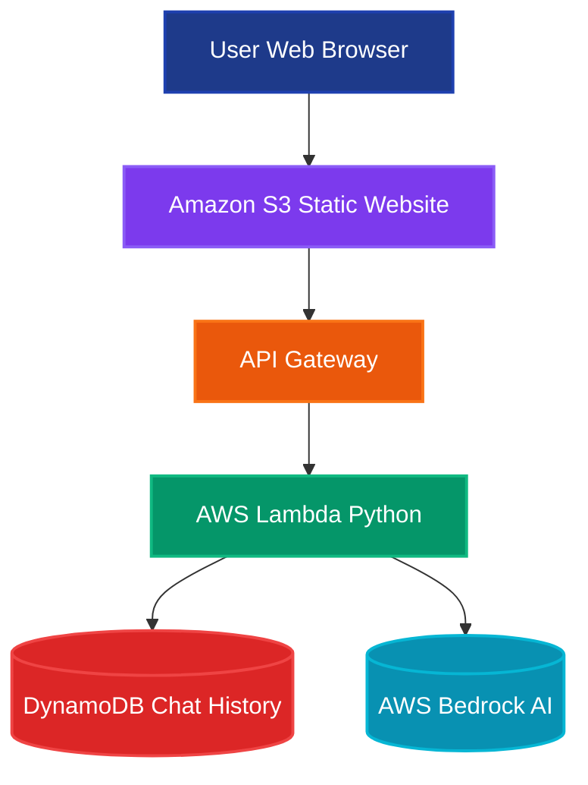

# Fairental AI Chatbot Platform

A robust, production-grade AI-powered chatbot platform for Fairental, providing instant customer support and intelligent admin oversight. Built with a modern React + Vite + Tailwind frontend and a scalable AWS Lambda backend.

---

## Features

- **AI Chatbot**: Friendly, professional, and informative customer support powered by AWS Bedrock and Strands SDK.
- **Admin Dashboard**: Review, search, and correct AI responses with a modern, responsive UI.
- **Correction History**: All admin corrections are logged and auditable.
- **Scalable & Secure**: Serverless backend, S3/CloudFront hosting, and DynamoDB for chat/correction logs.
- **Modern UI**: Google/AWS-inspired, fully responsive, and accessible.

---

## Architecture



---

## Frontend

- **Tech Stack**: React, TypeScript, Vite, Tailwind CSS, shadcn-ui, Lucide icons
- **Key Components**:
  - `CustomerChat`: Customer-facing chat interface
  - `AdminDashboard`: Admin panel for reviewing and correcting AI responses
  - `CorrectionModal`: Modal for submitting corrections
  - `ui/`: Reusable UI primitives (buttons, cards, tables, etc.)
- **Favicon**: Uses `favicon.png` (place in `public/` before build)
- **API Integration**: Connects to AWS API Gateway endpoints for chat, corrections, and history

### Running Locally

```sh
cd FRONTEND
npm install
npm run dev
```

### Building for Production

```sh
npm run build
```

- Output is in `FRONTEND/dist/`
- Deploy the **contents** of `dist/` to S3 or your static host

---

## Backend

- **Tech Stack**: Python, AWS Lambda, DynamoDB, Bedrock, Strands SDK
- **Main File**: `BACKEND/lambda_function.py`
- **Endpoints** (via API Gateway):
  - `POST /chat`: Process user chat messages, log Q/A, return AI response
  - `POST /admin/correct`: Admin submits a correction for an AI response
  - `GET /admin/history`: Retrieve chat/correction history (with filters)
- **Logging**: All interactions and corrections are logged in DynamoDB
- **Knowledge Base**: Uses Bedrock for knowledge retrieval and integrates admin corrections into AI answers

### Environment Variables

- `DYNAMODB_TABLE_NAME` (default: `fairbot-agent-history`)
- `BEDROCK_KB_ID` (required)
- `BEDROCK_MODEL_ID` (default: `anthropic.claude-3-sonnet-20240229-v1:0`)
- `AWS_REGION` (default: `us-east-1`)

---

## Deployment

### Frontend

1. Place your `favicon.png` in `FRONTEND/public/`
2. Build the frontend:
   ```sh
   npm run build
   ```
3. Deploy the **contents** of `FRONTEND/dist/` to your S3 bucket or static host
4. Set `index.html` as the index document

### Backend

- Deploy `lambda_function.py` as an AWS Lambda function
- Set up API Gateway with the required endpoints
- Configure environment variables in Lambda

---

## Favicon & Static Assets

- Only `favicon.png` is used (no `.ico`)
- If you update the favicon, increment the version in the `<link rel="icon" ...>` tag in `index.html` and rebuild
- Hard refresh your browser after deployment to see favicon changes

---

## Useful Tips

- For best performance and security, use S3 + CloudFront for hosting
- Monitor Lambda and DynamoDB usage in AWS Console
- Update the API Gateway URL in `.env` if you redeploy the backend
- The frontend is fully responsive and uses a professional, Google/AWS-inspired UI

---

## Contact & Support

For issues or improvements, contact the Fairental engineering team or your AWS administrator. 